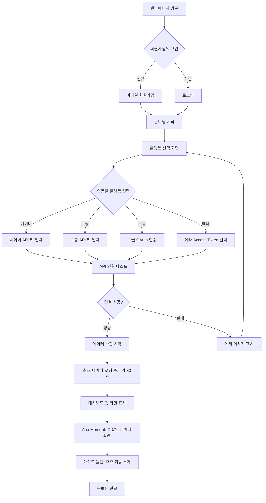
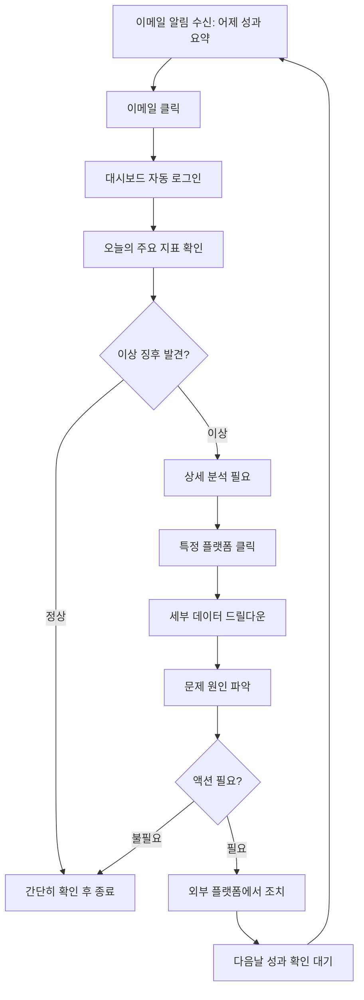
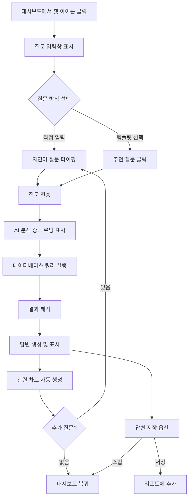
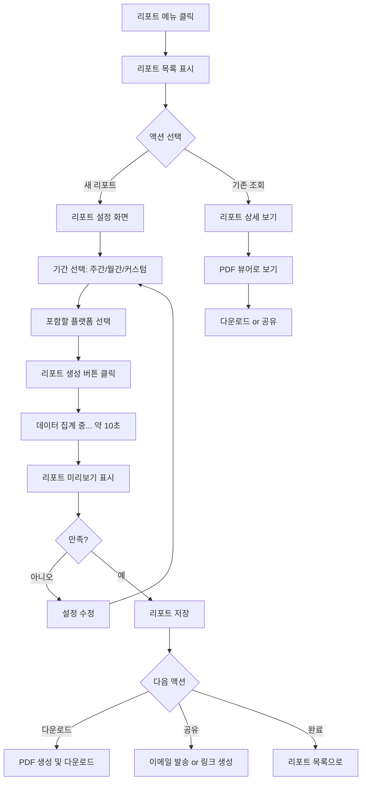
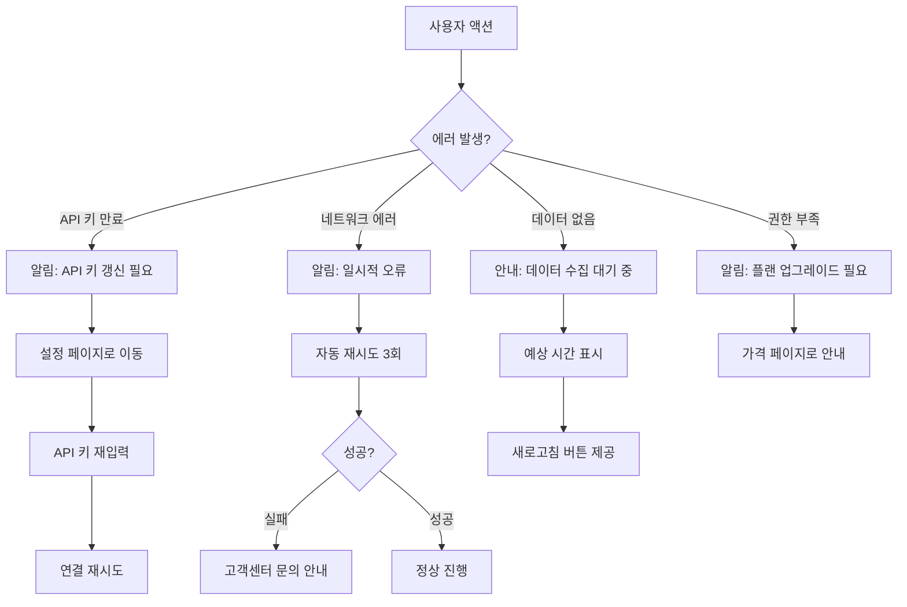

# 마케트(Markeet) User Flow (사용자 흐름도)

**프로젝트명:** 마케트(Markeet)  
**세션 ID:** MARKEET-2026-01-13  
**문서 버전:** v1.0  
**생성일:** 2026-01-13

---

## 핵심 사용자 여정

### FEAT-1: 데이터 통합 레이어 - 첫 온보딩 흐름



### 일일 루틴 흐름 (Sticky Loop)



### FEAT-2: 자연어 질의 흐름 (Phase 2)



### FEAT-3: 자동 리포트 생성 흐름 (Phase 2)



### 에러 처리 흐름



---

## 주요 화면별 상세 흐름

### 1. 온보딩 - 플랫폼 연동

**화면 구성:**
```
┌─────────────────────────────────────┐
│  마케트에 오신 것을 환영합니다!      │
│  광고 플랫폼을 연동해주세요          │
├─────────────────────────────────────┤
│                                      │
│  [네이버 검색광고]  [쿠팡 윙]       │
│  [구글 애즈]        [메타 광고]     │
│  [카카오모먼트]     [11번가]        │
│                                      │
│  최소 1개 이상 연동이 필요합니다     │
│                                      │
│  [나중에 하기]      [다음 →]        │
└─────────────────────────────────────┘
```

**사용자 액션:**
1. 플랫폼 카드 클릭
2. 모달 팝업: API 키 입력 폼
3. "연동하기" 버튼 클릭
4. 로딩 → 성공/실패 메시지
5. 다른 플랫폼 계속 연동 or "다음" 클릭

---

### 2. 대시보드 메인

**화면 구성:**
```
┌──────────────────────────────────────────────┐
│  마케트                         [알림] [설정] │
├──────────────────────────────────────────────┤
│  최근 7일 성과                                │
│  ┌──────┐  ┌──────┐  ┌──────┐              │
│  │ 총 광고비 │ 총 매출 │ ROAS  │              │
│  │ 1.2M    │ 3.8M   │ 3.2   │              │
│  └──────┘  └──────┘  └──────┘              │
│                                              │
│  플랫폼별 성과                                │
│  [막대 그래프]                               │
│                                              │
│  일자별 추이                                  │
│  [라인 차트]                                 │
│                                              │
│  [💬 AI에게 질문하기]                        │
└──────────────────────────────────────────────┘
```

**사용자 액션:**
1. 지표 카드 클릭 → 세부 화면
2. 그래프 호버 → 툴팁 표시
3. "AI에게 질문하기" 클릭 → 챗봇 열림

---

### 3. 설정 - API 키 관리

**화면 구성:**
```
┌──────────────────────────────────────┐
│  설정                                 │
├──────────────────────────────────────┤
│  연동된 플랫폼                         │
│                                       │
│  ✅ 네이버 검색광고                   │
│     마지막 동기화: 2시간 전            │
│     [재연동] [삭제]                   │
│                                       │
│  ✅ 쿠팡 윙                           │
│     마지막 동기화: 1시간 전            │
│     [재연동] [삭제]                   │
│                                       │
│  ❌ 구글 애즈                         │
│     API 키 만료됨                     │
│     [갱신하기]                        │
│                                       │
│  [+ 새 플랫폼 추가]                   │
└──────────────────────────────────────┘
```

**사용자 액션:**
1. "재연동" → API 키 재입력 모달
2. "삭제" → 확인 다이얼로그 → 연동 해제
3. "갱신하기" → 새 API 키 입력

---

## 상태 관리 흐름

### 인증 상태

```
미인증 → 로그인/회원가입 → 인증됨
                              ↓
                        온보딩 필요?
                        /           \
                       예            아니오
                       ↓              ↓
                    온보딩 화면     대시보드
```

### 데이터 로딩 상태

```
초기 상태
  ↓
API 호출
  ↓
로딩 중 (스켈레톤 UI)
  ↓
성공 → 데이터 표시
실패 → 에러 메시지 + 재시도 버튼
```

---

## 반응형 UI 흐름

### 모바일 (< 640px)

- 햄버거 메뉴
- 카드 1열 레이아웃
- 간소화된 차트 (작은 화면)
- 하단 네비게이션 바

### 태블릿 (640px ~ 1024px)

- 접을 수 있는 사이드바
- 카드 2열 레이아웃
- 전체 차트 표시

### 데스크톱 (> 1024px)

- 고정 사이드바
- 카드 3열 레이아웃
- 큰 차트 + 상세 정보
